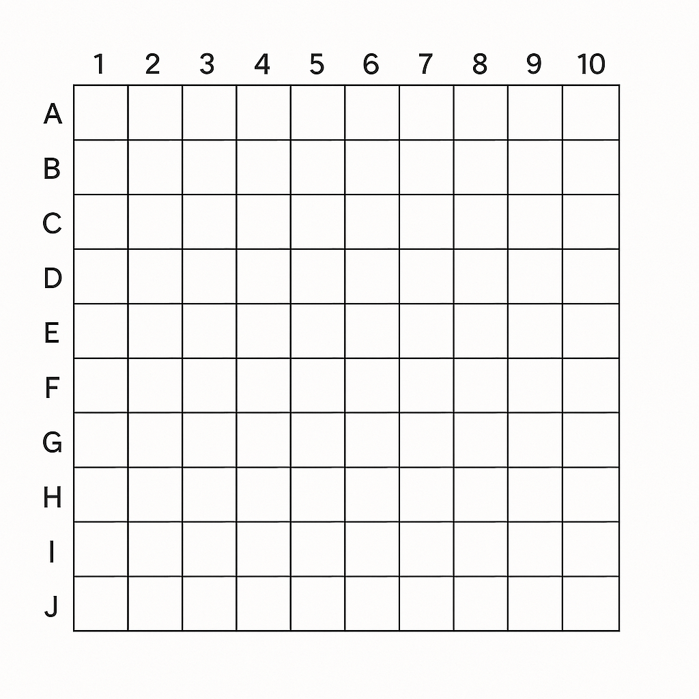

# Testes do Sistema de Batalha Naval - Nível Novato



## Índice
- 1. Teste de Funcionamento Básico
  - 1.1 Cenário: Posicionamento Padrão de Navios
- 2. Teste de Validação de Posicionamento
- 3. Teste com Valores Extremos
- 4. Guia de Execução de Testes

---
# 1. Teste de Funcionamento Básico

## 1.1 Cenário: Posicionamento Padrão de Navios

**Configuração:**
- Tabuleiro 5x5
- Navio horizontal (tamanho 3) na linha 1, coluna 1
- Navio vertical (tamanho 3) na linha 0, coluna 3

**Saída Esperada:**

***Nível Novato***
```
=== Jogo de Batalha Naval - Nivel Novato ===

Tabuleiro (10x10):
Legenda: 0 = Agua, 3 = Navio

   0 1 2 3 4 5 6 7 8 9 
0: 0 0 0 0 0 3 0 0 0 0 
1: 0 0 0 0 0 3 0 0 0 0 
2: 0 0 3 3 3 3 0 0 0 0 
3: 0 0 0 0 0 0 0 0 0 0 
4: 0 0 0 0 0 0 0 0 0 0 
5: 0 0 0 0 0 0 0 0 0 0 
6: 0 0 0 0 0 0 0 0 0 0 
7: 0 0 0 0 0 0 0 0 0 0 
8: 0 0 0 0 0 0 0 0 0 0 
9: 0 0 0 0 0 0 0 0 0 0 
```

**Verificações:**
1. Navio horizontal ocupa posições (1,1), (1,2), (1,3)
2. Navio vertical ocupa posições (0,3), (1,3), (2,3)
3. As demais posições contêm água (0)


***Nível Aventureiro***
```
=== Jogo de Batalha Naval - Nivel Aventureiro ===

Tabuleiro (10x10):
Legenda: 0 = Agua, 3 = Navio

      0 1 2 3 4 5 6 7 8 9 
 0:  0 0 0 0 0 3 0 0 0 0 
 1:  0 0 0 0 0 3 0 3 0 0 
 2:  0 0 3 3 3 3 3 0 0 0 
 3:  0 0 0 0 0 3 0 0 0 0 
 4:  0 3 0 0 0 0 0 0 0 0 
 5:  0 0 3 0 0 0 0 0 0 0 
 6:  0 0 0 3 0 0 0 0 0 0 
 7:  0 0 0 0 0 0 0 0 0 0 
 8:  0 0 0 0 0 0 0 0 0 0 
 9:  0 0 0 0 0 0 0 0 0 0 
```
**Verificações:**
1. Navio horizontal ocupa posições (2,2), (2,3), (2,4)
2. Navio vertical ocupa posições (0,5), (1,5), (2,5)
3. Navio diagonal positiva (/) ocupa posições (4,1), (5,2), (6,3)
4. Navio diagonal negativa () ocupa posições (1,7), (2,6), (3,5)
5. As demais posições contêm água (0)

---
# 2. Teste de Validação de Posicionamento

## 2.1 Cenário: Tentativa de posicionamento inválido

**Modificação no código (para teste):**
```c
// Tentar posicionar navio fora do tabuleiro
if (!posicionarNavio(tabuleiro, 3, 3, true)) {
    printf("Erro: Navio horizontal nao cabe nesta posicao!\n");
}
```

**Saída Esperada**
```shell
Erro: Navio horizontal nao cabe nesta posicao!
```

# 3. Teste com Valores Extremos
## 3.1 Cenário: Posicionamento nas bordas do tabuleiro
**Modificação no código (para teste):**
```c
// Navio horizontal no canto inferior esquerdo
posicionarNavio(tabuleiro, 4, 0, true);
// Navio vertical no canto superior direito
posicionarNavio(tabuleiro, 0, 4, false);
```

**Saída Esperada**
```shell
   0 1 2 3 4 
0: 0 0 0 3 3 
1: 0 3 3 3 3 
2: 0 0 0 3 3 
3: 0 0 0 3 0 
4: 3 3 3 0 0 
```

# 4. Guia de Execucão de Testes
## 4.1 Teste manual interativo (compilação)
```shell
gcc batalha_naval.c -o batalha_naval -Wall
./batalha_naval
```

## 4.2 Teste automatizado (Linux/Mac)
```shell
gcc batalha_naval.c -o batalha_naval -Wall
./batalha_naval > saida.txt
diff saida.txt esperado.txt
```
